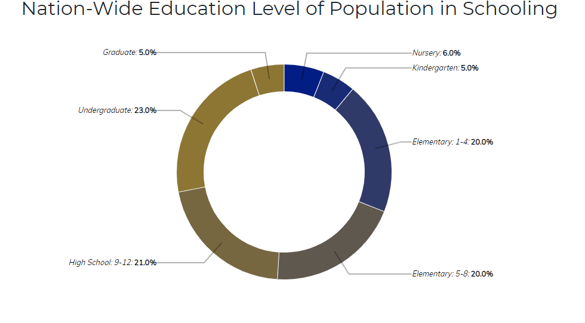
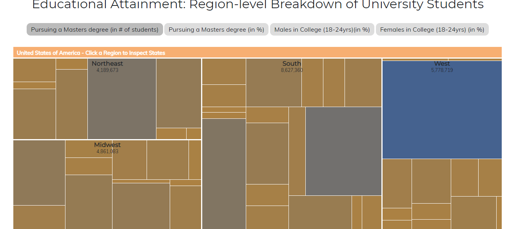

# ΤΕΛΙΚΗ ΑΝΑΦΟΡΑ  HCI

## Εργασία Ανάπτυξης 
### Τίτλος εργασίας: Εργασία Ανάπτυξης: Οπτικοποίηση δεδομένων εκπαιδευτικού συστήματος (USA)
## RADU ANDREEA MARIA
## Π2017127
#### [Προφίλ στο github](https://github.com/P17rant 'Προφίλ στο github')

#### [Εκτλεσιμο λινκ](https://P17rant.github.io/D3js-US-educational-attainment/ 'Εκτλεσιμο λινκ')

#### [Λινκ αποθετηρίου εργασίας](https://github.com/P17rant/D3js-US-educational-attainment 'Λινκ αποθετηρίου εργασίας')

#### [Λινκ εκτελεσίμου τελικης αναφοράς](https://P17rant.github.io/hci-Final-Report/ 'Λινκ αποθετηριου τελικης αναφοράς')

# Εισαγωγή
Η εργασία αυτή έχει ως σκοπό την χρήση του Github και την εκμάθηση των γλωσσών προγραμματισμού CSS, μια βιβλιοθήκης Javascript (D3.js) και HTML. 
## Παραδοτέο 1

 - [x] Άλλαξα τα χρώματα στα 3 γραφήματα.
 - [x] Αντικατέστησα τις διεπαφές στα "κουμπιά" του 2ου και 3ου γραφήματος.
 - [x] Όταν το ποντίκι διέρχεται επάνω από κάθε επιλογή του menu στην κορυφή της σελίδας, ακούγεται κάποιος ήχος.
 - [x] Όταν το ποντίκι διέρχεται πάνω από κάποια πρόταση/κείμενο της σελίδας ή περιοχή που περιλαμβάνει γραπτή πληροφορία (π.χ. κάποιο τμήμα γραφήματος), ακούγεται αυτόματα η αφήγηση του κειμένου (text-to-speech).
 - [x] Εφάρμοσα responsive design στη σελίδα (Bootstrap) και κυρίως στο αρχικό menu έτσι ώστε να προσαρμόζεται σε οθόνες διαφορετικών διαστάσεων.

<scriρt src="https://stackpath.bootstrapcdn.com/.../bootstrap.min.js"...></script>

## Παραδοτέο 2
 ### Ζητούμενα στα οποία απαιτούνται αλλαγές στο προσωπικό σας αποθετήριο
* [x]  **Τροποποιήσα** τον **κώδικα** και το **μενού** της εφαρμογής έτσι ώστε κάθε στιγμή να είναι εμφανές **μόνο ένα** από τα 3 γραφήματα, **παραμένοντας** πάντα στη σελίδα **index.html**.

 * [ ]  **Αντικαταστήστε** το κάθε ένα από τα 3 γραφήματα με κάποιο άλλο διαδραστικό γράφημα της **D3js**.
 * [x]  Σε μια καινούργια σελίδα, να τοποθετήσεα αντίστοιχα 3 **νέα** διαδραστικά γραφήματα **D3js** , τα οποία  οπτικοποιούν μια **καινούργια** σελιδα με στατιστικά **δεδομένα** που θα βρήκα από την [ΕΛΣΤΑΤ](http://www.statistics.gr/ 'ΕΛΣΤΑΤ')

 
## Συμπεράσματα

 Η βιβλιοθηκη D3.js είναι μια σχετικά εύκολη βιβλιοθήκη αφού ειναι εύχρηστη για την υλοποίηση απλών και σύνθετων διαγραμμάτων.
